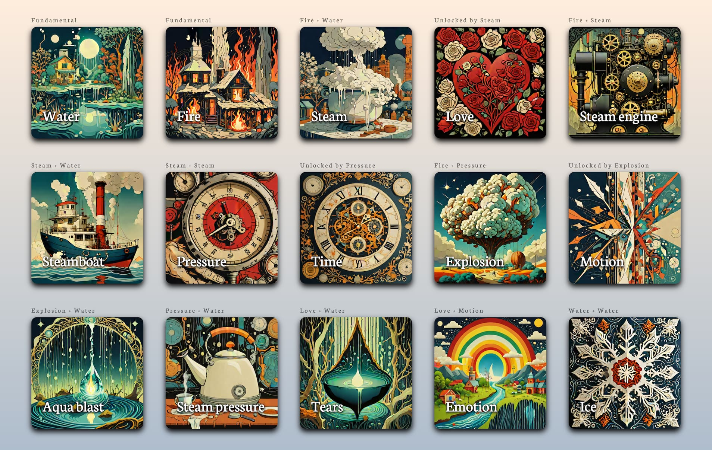

# AI Alchemy Game

My kids love alchemy games, like Doodle God Universe, where you combine elements to make new elements.
AI is great for this kind of game: every combination will produce something cool!



## How to run it

You need at least 12 GB GPU memory to run this.

We use [ComfyUI](https://github.com/comfyanonymous/ComfyUI) for generating the images. Start it up.

You can replace the ComfyUI workflow in `comfyui_workflow.json` if you want.
As it is, it's [SDXL Turbo](https://stability.ai/news/stability-ai-sdxl-turbo).

```
pip install -r requirements.txt
uvicorn server:app --reload
```

Then go to http://localhost:8000/ and start playing! You can change the rules and prompts in
the files in `configs`. Or add your own!
(See [screenshots](https://github.com/darabos/ai-alchemy/tree/main/screenshots) for some variants.)

It uses an [optimized Mistral-7B-Instruct](https://huggingface.co/jncraton/Mistral-7B-Instruct-v0.2-ct2-int8)
model for generating the text.

## Is AI art okay?

Mostly no. I think it violates the copyright of the original authors.
Individual creators are especially vulnerable. They can't possibly hunt down every model trained on their work.

My excuses are:
- It was super easy. The models are public. The game was working before I had time to think about ethics.
- There is no alternative for such a game. I could not have drawn millions of images for every possible combination.

The prompt in `elemental.yml` is copied from a [random image on Civitai](https://civitai.com/images/4027144).
It lists the following artists:
- [Victo Ngai](https://victo-ngai.com/)
- [Oleksandra Ekster](https://en.wikipedia.org/wiki/Aleksandra_Ekster)
- [Kazimir Malevich](https://en.wikipedia.org/wiki/Kazimir_Malevich)
- [Vladyslav Yerko](https://www.facebook.com/p/Vladyslav-Yerko-100063774308016/)
- [Alexander Jansson](https://alexanderjansson.com/)
